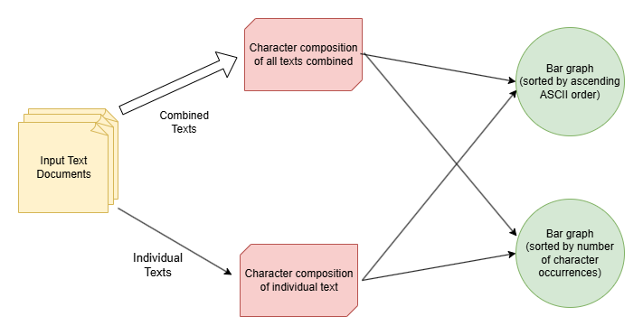

# Snakemake Character Frequency within Text

This pipeline uses input texts provided by the user to generate information (in plain text and graphical form) on each text's character composition.

The current detailed installation process assumes access to the GPSC. Please connect to the GPSC prior to executing the below to ensure compatibility

TODO: install miniconda/prerequisites

## Getting Started

- Create and enter a working directory
- Clone repository
```
git clone https://github.com/Xsylum/snakemake-char-frequency.git .
```

### Setting up the Conda environment

In order to run the pipeline, a conda environment with access to snakemake and slurm commands must first be activated

```
conda env create -f environments/slurmmake_env.yaml -p ./slurmmake
conda activate ./slurmmake
```

Additional packages used by rules in the pipeline can be downloaded through executing the below command:
```
snakemake --profile profile -f download  
```

### Running the Pipeline (Snakemake)

1. Place the texts you want counted into the ./Input directory
2. Execute the below command (while using slurmmake environment)
```
snakemake --profile profile all
```
3. The desired pipeline output files can be viewed, as detailed in the below "Outputs folder contents" section

## Outputs folder contents
After running the above snakemake command, desired output files can be found in the following subdirectories:

- CharDataOutput: Records of how many times a character appeared in a specific text
- CombinedCharOutput: Record of how many times a character appeared across all Input texts
- Graphs (Easiest to access via SSHFS-Win, opens in browser):
    - char_sorted: Bar graphs for each text, sorted in alphabetical order (according to ASCII standards)
    - combined_chars: Two bar graphs, sorted in both formats, for the combined characters of all Input texts
    - magnitude_sorted: Bar graphs for each text, sorted in order of most occurrences of the character

## Pipeline Overview
